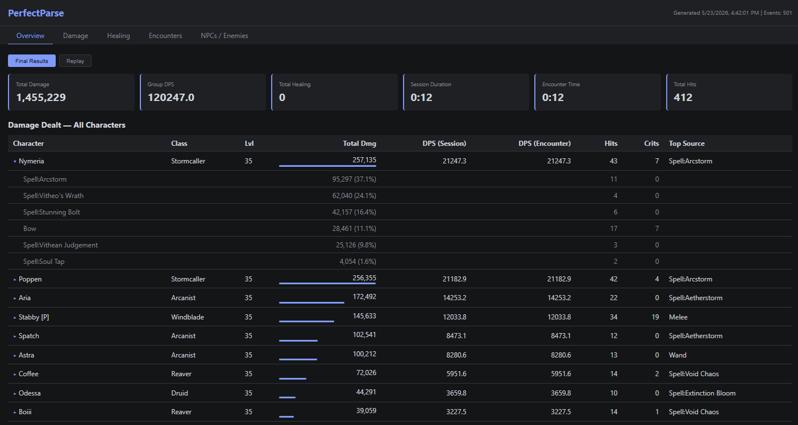

# PerfectParse

A combat parser mod for **Erenshor** that tracks real-time combat events and generates self-contained HTML reports with DPS calculations, damage/healing breakdowns, and encounter tracking. Uses the [Lunaris](https://erenshorvault.app) mod loader.



## Features

- Intercepts all damage and healing events via Harmony patches
- Tracks melee, ranged, skills, spells, wands, bleeds, reflects, and Finale instant-kills
- Healing tracking with spell attribution, HoT ticks, and overhealing
- Entity identification: player, sim party members, pets, and NPCs
- Automatic and manual encounter boundaries with idle timeout
- JSONL event logging (async, non-blocking background writer) with automatic file rotation at configurable size cap
- **Live in-game combat window** (F11) with:
  - 5 tabs: Overview, Damage, Healing, Encounters, Targets
  - Real-time DPS, damage, and healing stats updated during combat
  - Expandable per-character breakdowns with damage type and source detail
  - **Targets tab** with incoming damage by attacker and outgoing damage by target
  - Color-coded damage types (Physical, Magic, Elemental, Void, Poison)
  - Draggable and resizable window (position/size saved between sessions)
  - Background darkens on mouse hover for readability
  - Reset button to clear stats without restarting
- Generates report and opens in default browser on F10
- Streaming HTML report generation (memory-efficient for long sessions)
- Self-contained HTML reports with:
  - 6 tabs: Overview, Damage, Healing, Encounters, NPCs/Enemies, Targets
  - Expandable per-character breakdowns with damage type/source detail
  - **Targets tab** with nested expandable incoming/outgoing damage breakdowns
  - DPS by session and encounter time
  - Damage type color coding
  - Replay mode with adjustable playback speed
  - Sortable columns

## Requirements

- Erenshor (Steam)
- **Lunaris** mod loader — Erenshor-specific mod loader ([erenshorvault.app](https://erenshorvault.app))
- .NET Framework 4.8 SDK (for building)

## Building

```bash
dotnet build ErenshorCombatParser/ErenshorCombatParser.csproj -c Release
dotnet build PerfectParseReport/PerfectParseReport.csproj -c Release
```

The mod DLL requires references to Harmony, Lunaris, and Erenshor game assemblies. The `.csproj` auto-detects the game install path (checks `Erenshor Playtest` first, then `Erenshor`). Override with `-p:GameDir="C:\path\to\game"` if needed. After a successful build, the DLL is automatically copied to `<GameDir>/plugins/PerfectParse/`.

> **Note:** `Lunaris.dll` must be present in the game directory at build time. Lunaris is auto-downloaded when the game launches — run the game once to obtain it.

Output:
- `ErenshorCombatParser/bin/Release/net48/PerfectParse.dll` — the mod plugin
- `PerfectParseReport/bin/Release/net472/PerfectParseReport.exe` — standalone report generator

## Installation

Install via the [Erenshor Vault](https://erenshorvault.app), or manually copy `PerfectParse.dll` and `PerfectParseReport.exe` into:

```
<Game Folder>/plugins/PerfectParse/
```

## Usage

| Hotkey | Action |
|--------|--------|
| F9 | Toggle manual encounter start/stop |
| F10 | Generate HTML report and open in browser |
| F11 | Toggle live in-game combat stats window |

Logs and reports are saved to `<Game Folder>/plugins/PerfectParse/logs/`.

**Standalone report generator:** Run `PerfectParseReport.exe` to convert the latest JSONL log into an HTML report without the game running. Supports drag-and-drop or command line: `PerfectParseReport.exe <file.jsonl> [output.html]`.

## Configuration

Generated after first run at `<Game Folder>/plugins/PerfectParse/config.json`.

| Section | Key | Default | Description |
|---------|-----|---------|-------------|
| Hotkeys | EncounterToggle | F9 | Manual encounter key |
| Hotkeys | GenerateReport | F10 | Report generation key |
| Hotkeys | ToggleWindow | F11 | In-game stats window key |
| Encounters | IdleTimeout | 5.0 | Seconds before auto-ending encounter |
| General | EnableLogging | true | Master logging toggle |
| General | OutputDirectory | *(blank)* | Custom output path |
| General | OpenInOverlay | true | Open report in browser on generation |
| General | OpenReportOnExit | false | Open report in browser when the game closes |
| General | MaxLogSizeMB | 25 | Max JSONL file size (MB) before rotating to new file |
| Window | X | 20 | Window X position (pixels) |
| Window | Y | 20 | Window Y position (pixels) |
| Window | Width | 560 | Window width (pixels) |
| Window | Height | 420 | Window height (pixels) |
| Window | FontSize | 11 | Base font size for the in-game window (increase for high-res displays) |
| Filters | LogEnvironmental | false | Log environmental damage |

## Project Structure

```
ErenshorCombatParser/        Main mod (plugin DLL)
  LunarisEntry.cs            Lunaris entry point
  Core/                      Core logic, event bus, entity registry, encounter tracker
    PluginCore.cs             Core plugin logic (config, hotkeys, lifecycle)
    PluginConfig.cs           Config container
    LunarisConfig.cs          Lunaris config class with attributes
    Log.cs                    Logging abstraction
  Patches/                   Harmony patches for damage, healing, context, finale
  Models/                    CombatEvent, HealEvent, Encounter
  IO/                        JSONL writer, HTML report generator, HTML template
  UI/                        In-game IMGUI combat stats window

PerfectParseReport/          Standalone CLI report generator (EXE)
```

## Known Issues

- **"Spell:Unknown" in damage sources:** Most NPC special abilities (AoE ticks, breath attacks, boss mechanics) are now identified by name via dedicated patches. A few undiscovered NPC scripts or coroutine-based mechanics may still show as "Spell:Unknown". If you encounter one, please report it.
- **Bleed damage attribution:** The game passes `null` as the attacker for all bleed ticks. PerfectParse recovers the original caster from the target's status effect data, correctly attributing bleed damage even with multiple concurrent bleed sources. Bleed ticks now show the originating skill/spell name (e.g., `Bleed:Razor Tipped Arrow`) rather than generic "Bleed".

## License

[MIT](LICENSE)
